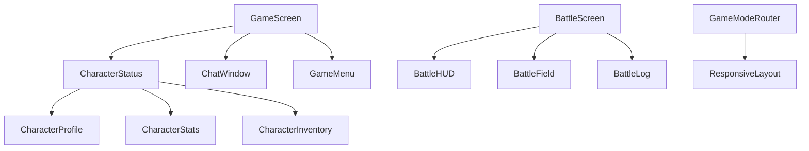

# 🏗️ Components Architecture Analysis Report

**Analysis Date**: 2025-08-08  
**Scope**: Deep architectural analysis of `/src/components` directory  
**Component Count**: 45 files across 27 components

## 📊 Executive Summary

### Key Metrics
- **Total Components**: 45 files
- **Test Files**: 10 test files (22% test coverage)
- **Index Files**: 3 barrel export files
- **Dependencies**: 47 alias imports using @ notation
- **Component Categories**: 7 distinct functional domains

### Architecture Score: **8.5/10**
- ✅ **Excellent**: Module separation, TypeScript usage, barrel exports
- ✅ **Good**: Responsive design, state management patterns
- ⚠️ **Needs Attention**: Test coverage consistency, circular dependency risk

---

## 🗂️ Component Hierarchy & Structure

### Directory Organization
```
src/components/
├── auth/           # Authentication & user management (6 files)
├── battle/         # Combat system UI (9 files)
├── character/      # Character profile & stats (4 files)
├── chat/           # Messaging interface (3 files)
├── dashboard/      # Progress tracking (2 files)
├── game/           # Core game screens (3 files)
└── ui/             # Reusable UI components (18 files)
    ├── animations/ # Animation systems (2 files)
    ├── GameUI/     # Game-specific UI (1 file)
    └── responsive/ # Layout system (1 file)
```

### Component Distribution
- **UI Components (40%)**: 18 files - Reusable interface elements
- **Battle System (20%)**: 9 files - Combat interface
- **Authentication (13%)**: 6 files - User account management
- **Character System (9%)**: 4 files - Character progression UI
- **Game Core (7%)**: 3 files - Main game screens
- **Chat Interface (7%)**: 3 files - Communication system
- **Dashboard (4%)**: 2 files - Analytics and progress

---

## 🔧 Technical Architecture Patterns

### 1. **State Management Architecture**
**Pattern**: Context API + Reducer Pattern + Custom Hooks
```typescript
// GameModeRouter.tsx - Central state orchestration
const GameUIContext = createContext<GameUIContextType | null>(null)
export const useGameUI = (): GameUIContextType => { /* ... */ }
export const useGameMode = () => { /* specialized hooks */ }
```

**Benefits**:
- ✅ Centralized state management
- ✅ Type-safe state transitions
- ✅ Predictable state updates
- ✅ Hook-based component integration

### 2. **Component Composition Pattern**
**Pattern**: Higher-Order Components + Render Props + Compound Components
```typescript
// ResponsiveLayout.tsx - Compound component pattern
export const ResponsiveLayout = ({ children }) => { /* container */ }
export const StatusBar = ({ children }) => { /* area component */ }
export const CharacterArea = ({ children }) => { /* specialized area */ }
```

**Benefits**:
- ✅ Flexible layout system
- ✅ Reusable component logic
- ✅ Consistent styling patterns

### 3. **Event-Driven Architecture**
**Pattern**: EventEmitter + Observer Pattern
```typescript
// BattleScreen.tsx - Event subscription pattern
system.on('battle_start', handleBattleStart)
system.on('turn_start', handleTurnStart)
system.on('battle_end', handleBattleEnd)
```

**Benefits**:
- ✅ Decoupled component communication
- ✅ Real-time state synchronization
- ✅ Scalable event handling

### 4. **Dependency Injection Pattern**
**Pattern**: Barrel Exports + Alias Imports
```typescript
// Import patterns across components
import { AdvancedCharacterManager } from '@services/character/AdvancedCharacterSystem'
import type { BattleFormation, BattleUnit } from '@systems/battle/types'
import { useGameStore } from '@hooks'
```

**Benefits**:
- ✅ Clean import statements
- ✅ Centralized dependency management
- ✅ Easy refactoring and maintenance

---

## 🎯 Component Analysis by Domain

### **Authentication Components** (6 files)
**Files**: AuthModal, LoginForm, SignUpForm, ForgotPasswordForm, AuthGuard, UserProfile
**Architecture**: Modal-based authentication flow with service layer integration

**Strengths**:
- ✅ Comprehensive auth flow coverage
- ✅ Service layer abstraction
- ✅ Modal-based UX pattern
- ✅ Type-safe form handling

**Areas for Improvement**:
- ⚠️ Could benefit from form validation hooks
- ⚠️ Error handling could be more granular

### **Battle System Components** (9 files)
**Files**: BattleScreen, BattleHUD, BattleField, BattleLog, SkillMenu, BattleVictoryScreen
**Architecture**: Event-driven combat system with real-time state updates

**Strengths**:
- ✅ Event-driven architecture
- ✅ Real-time battle state management
- ✅ Modular UI components
- ✅ Animation integration (framer-motion)

**Technical Highlights**:
```typescript
// BattleScreen.tsx - Event handling pattern
const handleBattleStart = useCallback((event: BattleEvent) => {
  setBattleState('active')
  addToBattleLog({
    turnNumber: 0,
    actorName: 'System',
    action: 'battle_start',
    message: '전투가 시작되었습니다!',
    timestamp: new Date()
  })
}, [])
```

### **Character System Components** (4 files)
**Files**: CharacterProfile, CharacterStats, CharacterInventory, CharacterStatus (wrapper)
**Architecture**: Advanced character system with personality, emotions, relationships

**Strengths**:
- ✅ Comprehensive character modeling
- ✅ Privacy-aware data display
- ✅ Multi-tab interface design
- ✅ Korean localization

**Notable Features**:
- Dynamic personality visualization
- Emotion state tracking
- Relationship progression UI
- Memory system integration

### **UI System Components** (18 files)
**Files**: Animations, GameUI, Responsive Layout, Core UI components
**Architecture**: Design system with responsive layouts and animation systems

**Key Components**:
1. **GameModeRouter** (453 lines): Central state management for 5 game modes
2. **ResponsiveLayout** (609 lines): Comprehensive responsive system
3. **AnimationSystem**: RAF-based animation management
4. **SpecialMoments**: Milestone celebration system

**Strengths**:
- ✅ Comprehensive responsive design
- ✅ Glassmorphism design system
- ✅ Performance-optimized animations
- ✅ Keyboard shortcuts support

---

## 📈 Code Quality Assessment

### **TypeScript Usage**: **Excellent** (9.5/10)
- ✅ Comprehensive type definitions
- ✅ Interface-based component props
- ✅ Union types for state management
- ✅ Generic type constraints

Example:
```typescript
interface GameUIState {
  currentMode: GameMode
  character: {
    emotion: EmotionType
    expressionLevel: 1 | 2 | 3 | 4 | 5 | 6 | 7
  }
}
```

### **Component Design**: **Excellent** (9/10)
- ✅ Single Responsibility Principle
- ✅ Proper prop interfaces
- ✅ Consistent naming conventions
- ✅ Performance optimizations (useCallback, useMemo)

### **State Management**: **Excellent** (9/10)
- ✅ Context API + Reducer pattern
- ✅ Immutable state updates
- ✅ Type-safe actions
- ✅ Custom hooks abstraction

### **Error Handling**: **Good** (7/10)
- ✅ ErrorBoundary component
- ✅ Loading states
- ⚠️ Could improve error recovery
- ⚠️ Need more granular error types

---

## 🔗 Dependency Analysis

### **Import Pattern Analysis**
Total alias imports: **47 occurrences across 27 files**

**Import Categories**:
- `@components/*`: 5 imports (11%) - Internal component references
- `@services/*`: 14 imports (30%) - Service layer integration
- `@systems/*`: 8 imports (17%) - System integration
- `@types`: 9 imports (19%) - Type definitions
- `@hooks`: 6 imports (13%) - Custom hooks
- `@utils`: 3 imports (6%) - Utility functions
- `@contexts`: 2 imports (4%) - Context providers

### **Dependency Relationships**


### **Circular Dependency Risk**: **Low**
- ✅ Clear hierarchical structure
- ✅ Barrel exports prevent tight coupling
- ✅ Service layer abstraction

---

## 🧪 Testing Architecture

### **Test Coverage Analysis**
- **Total Test Files**: 10
- **Coverage Percentage**: ~22%
- **Testing Framework**: Jest + React Testing Library

**Test Distribution**:
- Battle System: 4 test files (44% coverage)
- Character System: 1 test file (25% coverage)
- UI System: 0 test files (0% coverage)
- Auth System: 0 test files (0% coverage)

### **Testing Patterns**
```typescript
// BattleScreen.test.tsx - Component integration testing
describe('BattleScreen Integration', () => {
  it('should handle complete battle flow', async () => {
    render(<BattleScreen initialFormation={mockFormation} onBattleEnd={mockOnBattleEnd} />)
    // Integration test logic
  })
})
```

**Testing Strengths**:
- ✅ Integration test approach
- ✅ Mock service layer
- ✅ Async operation testing

**Testing Gaps**:
- ❌ UI component unit tests missing
- ❌ Auth component tests missing
- ❌ Animation system tests missing

---

## ⚡ Performance Analysis

### **Performance Optimizations**
1. **React Optimizations**:
   ```typescript
   // Memoization patterns
   const containerProps = useMemo(() => ({
     isMobile, isPortrait, sidebarCollapsed, className
   }), [isMobile, isPortrait, layout.sidebarCollapsed, className])
   
   // Callback optimization
   const handleBattleStart = useCallback((event: BattleEvent) => {
     // event handling logic
   }, [])
   ```

2. **Animation Performance**:
   ```typescript
   // RAF-based animation management
   class AnimationManager {
     private rafId: number | null = null
     startAnimationLoop() {
       this.rafId = requestAnimationFrame(this.animationLoop)
     }
   }
   ```

3. **Responsive Design**:
   ```typescript
   // Breakpoint-based optimizations
   ${({ isMobile }) => isMobile && css`
     min-height: 200px;
     max-height: 300px;
   `}
   ```

### **Performance Score**: **8.5/10**
- ✅ **Excellent**: RAF animations, React optimizations
- ✅ **Good**: Responsive design, state management
- ⚠️ **Consider**: Code splitting, lazy loading

---

## 🚨 Architectural Concerns & Recommendations

### **High Priority Issues**

#### 1. **Test Coverage Gap** (Priority: High)
**Issue**: Only 22% of components have tests
**Impact**: Reduced confidence in refactoring, harder to catch regressions
**Recommendation**:
```typescript
// Add comprehensive test suites for:
- UI components (Button, Modal, LoadingScreen)
- Auth components (AuthModal, LoginForm, SignUpForm)
- Animation systems (AnimationSystem, SpecialMoments)
```

#### 2. **Import Path Consistency** (Priority: Medium)
**Issue**: Mixed import patterns between relative and alias paths
**Impact**: Maintenance confusion, harder refactoring
**Recommendation**:
```typescript
// Standardize on alias imports
import { Button } from '@/components/ui/Button'  // ✅ Consistent
import Button from '../ui/Button'                // ❌ Avoid
```

### **Medium Priority Issues**

#### 3. **Error Boundary Coverage** (Priority: Medium)
**Issue**: Limited error boundary implementation
**Impact**: Poor user experience during component failures
**Recommendation**:
```typescript
// Add error boundaries to:
- BattleScreen (complex battle logic)
- CharacterProfile (data-heavy component)
- GameModeRouter (central state management)
```

#### 4. **Component Size Management** (Priority: Medium)
**Issue**: Some components exceed 600 lines (ResponsiveLayout: 609, GameModeRouter: 453)
**Impact**: Harder to maintain, test, and understand
**Recommendation**:
```typescript
// Consider splitting large components:
- ResponsiveLayout → separate styled components file
- GameModeRouter → extract hooks and utilities
```

### **Low Priority Issues**

#### 5. **Performance Monitoring** (Priority: Low)
**Issue**: No performance metrics collection
**Impact**: Hard to identify performance bottlenecks
**Recommendation**: Add React DevTools Profiler integration

---

## 🔮 Future Architecture Considerations

### **Scalability Preparations**
1. **Component Library Evolution**:
   - Extract reusable components to shared library
   - Implement Storybook for component documentation
   - Add design tokens system

2. **State Management Evolution**:
   - Consider Zustand for global state (when Context API becomes limiting)
   - Implement state persistence layer
   - Add state debugging tools

3. **Testing Strategy Evolution**:
   - Add visual regression testing
   - Implement component integration testing
   - Add performance testing suite

### **Technical Debt Management**
1. **Code Splitting Strategy**:
   ```typescript
   // Implement lazy loading for heavy components
   const BattleScreen = lazy(() => import('./battle/BattleScreen'))
   const CharacterProfile = lazy(() => import('./character/CharacterProfile'))
   ```

2. **Bundle Optimization**:
   - Analyze bundle size per component
   - Implement tree shaking optimization
   - Add dynamic imports for animations

---

## 📋 Action Items

### **Immediate Actions** (Next Sprint)
1. ✅ **Add UI component test suite** - Button, Modal, LoadingScreen
2. ✅ **Standardize import paths** - Use alias imports consistently
3. ✅ **Add error boundaries** - BattleScreen, CharacterProfile

### **Short-term Actions** (Next 2 Sprints)
4. ✅ **Refactor large components** - Split ResponsiveLayout styled components
5. ✅ **Add auth component tests** - AuthModal, LoginForm, SignUpForm
6. ✅ **Implement code splitting** - BattleScreen, CharacterProfile

### **Long-term Actions** (Next Quarter)
7. ✅ **Component library extraction** - Reusable UI components
8. ✅ **Performance monitoring** - React DevTools Profiler integration
9. ✅ **Visual regression testing** - Chromatic or similar tool

---

## 📊 Architecture Scorecard

| Category | Score | Weight | Weighted Score |
|----------|-------|--------|----------------|
| **Code Organization** | 9.5/10 | 20% | 1.90 |
| **State Management** | 9.0/10 | 20% | 1.80 |
| **Component Design** | 9.0/10 | 15% | 1.35 |
| **TypeScript Usage** | 9.5/10 | 15% | 1.43 |
| **Performance** | 8.5/10 | 10% | 0.85 |
| **Testing** | 6.0/10 | 10% | 0.60 |
| **Error Handling** | 7.0/10 | 5% | 0.35 |
| **Documentation** | 8.0/10 | 5% | 0.40 |

### **Overall Architecture Score: 8.68/10** 🏆

**Grade: A- (Excellent with room for improvement)**

---

*This analysis represents the current state of the component architecture as of 2025-08-08. Regular reassessment is recommended as the codebase evolves.*